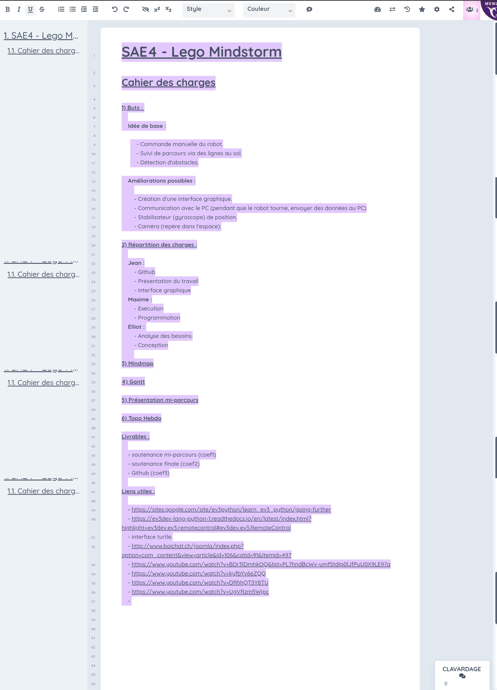
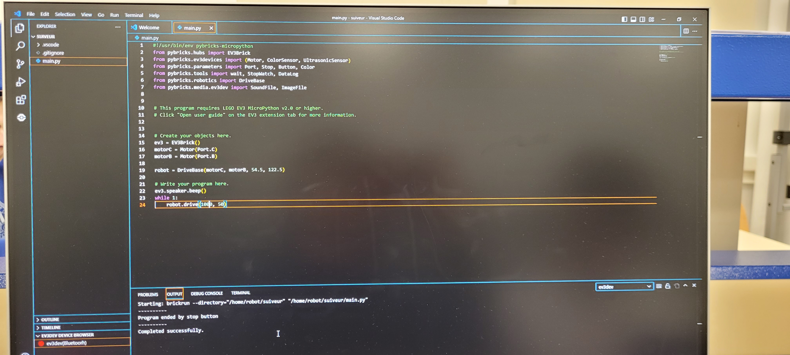
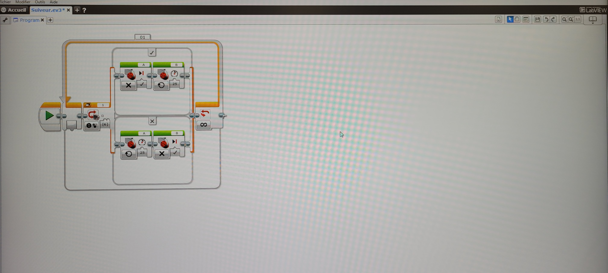
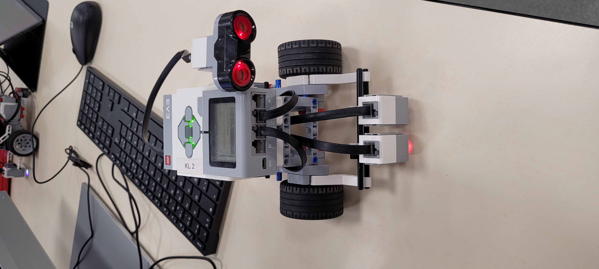

Bienvenue sur la SAE LEGO EV3 

Equipe : Elliot Veglio / Maxime Wegbecher / Jean Vogel

Référent : M.Mourillon / M.Hueber

Avancement :

Semaine du 30/01

Durant cette semaine nous avons eu notre premier cours pour la SAE du semestre 4.
Durant ce cours nous avons commencer par choisir un sujet parmi les 3 mis à disposition, notre choix c’est tourné vers le robot EV3. Par la suite nous avons mis au point un cahier des charges provisoire pour pouvoir visualiser les objectifs à atteindre avec notre robot, ainsi que ce fixer des tâches grossièrement. Ce cahier nous a ainsi permi a demender l'achat d'une caméra comme extension du robot. Ci-dessous le cahier des charges provisoire.

Semaine du 06/02

Après avoir recu des messages de M.Hueber pour nous dire que la caméra a bien été acheté et qu'elle sera livré le lundi 6 février, ainsi que pour nous rappeler à l'ordre sur le contrat pédagogique concernant la remise d'un contre rendu github, ainsi que d'un cahier des charges. Nous avons commencer notre deuxième cours en donnant un contre rendue de ce qui avait été déjà fait à M.Mourillon. La suite du cours c'est divisé en trois partie. Jean c'est occupé de la création du GitHub. Maxime a commencer à prendre en main le robot ainsi que l'application Lego Mindstorm Education, puis ila basculer sur Visual Studio Code pour créé un petit programme test en pyt. Quant à Elliot, il c'est attelé a developper un cahier des charges officiel, tout d'abord sur l'application trello puis sur l'application Jira afi de pouvoir directement avoir le diagramme de Gantt en parallèle du cahier des charges.

