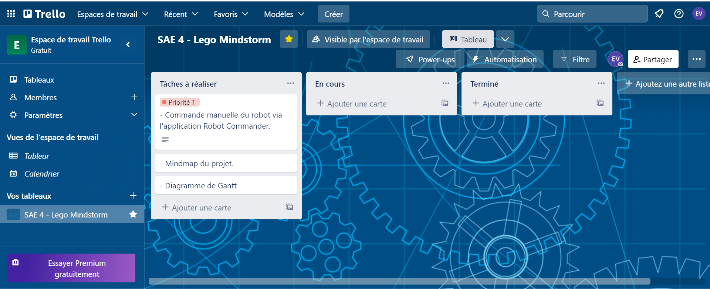

##### Semaine du 06/02

###### Déroulé :

1ère séance : 

-Achat caméra pixy 
-Contre rendu de la seamine précédente
-Elliot : Développement du cahier des charges officiel sur Trello
-Maxime : Codage sur visual studio code du suiveur de ligne, ainsi que du détecteur d'obsatcle fixe
-Jean : Alimentation du GitHub

###### Visualisation des objectifs : 

2ème séance : 

-Elliot : Prise en main de la pixy ainsi que modification des connectiques du cable d'alimentation
-Maxime : Construction du Robot EV3 et codage du gyroscope
-Jean : Explication et démonstration du projet a des lycéens

 

